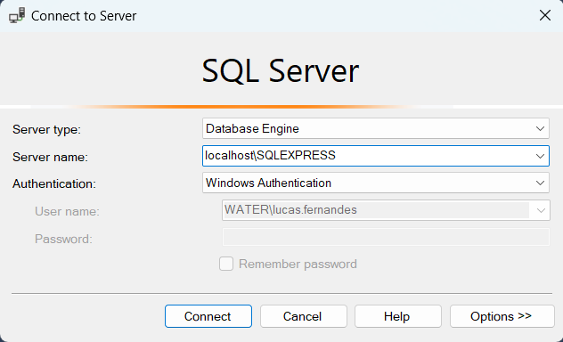
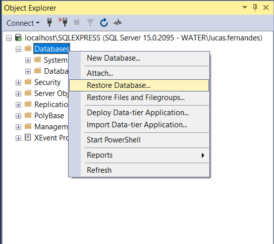
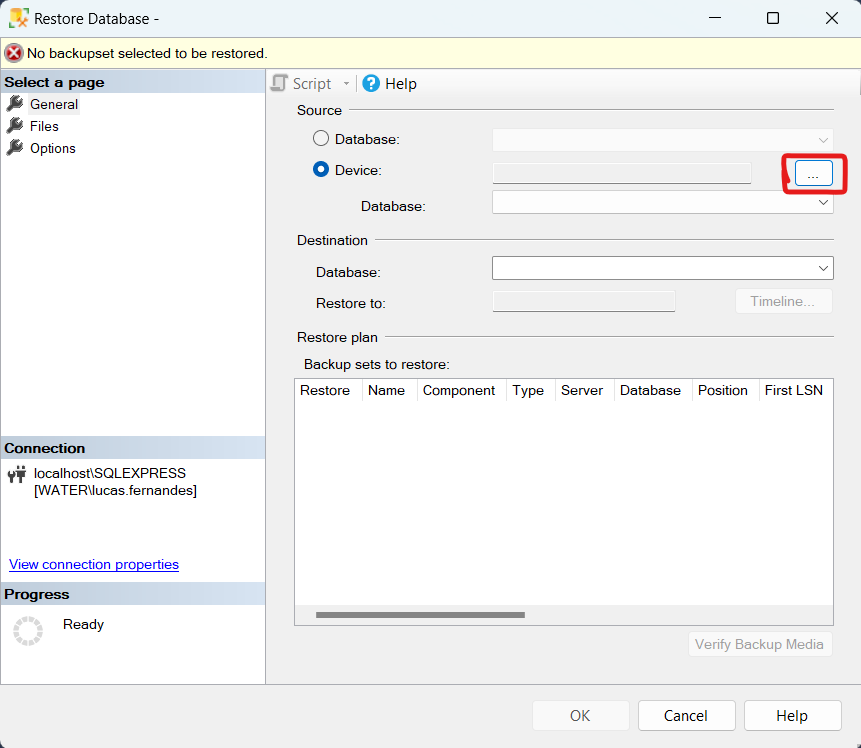
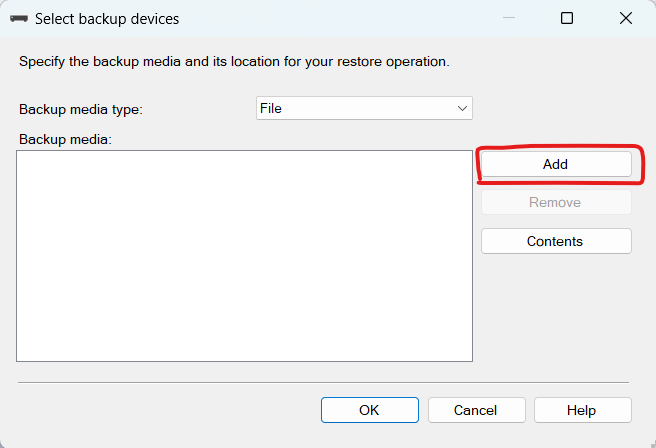
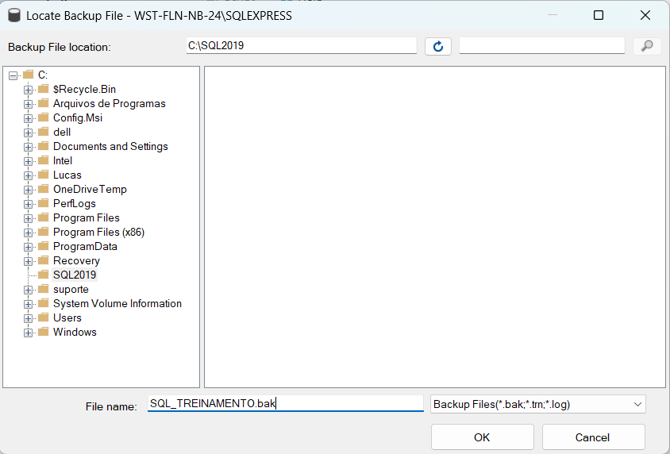
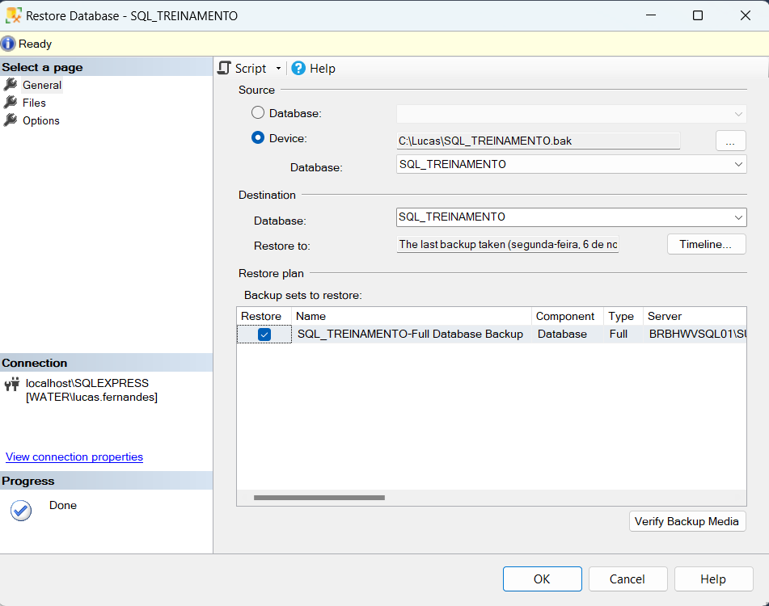

# 1. Restaurar um banco de dados localmente

1. Fazer o download do arquivo ***SQL_TREINAMENTO.bak*** disponibilizado para o treinamento e salvá-lo no disco **C:\\**.

2. Abrir o SQL Server Management Studio (SSMS) e se conectar à instância local, recentemente criada.
    

3. Na janela *Object Explorer*, selecionar o item *Banco de Dados/Databases* com o botão direito e, em seguida, *Restore Database*
    

4. Na janela que se abrir, selecionar *Device* como fonte do backup.
    

5. Na sequência, clicar em *Add* e localizar o arquivo de backup, no caminho onde foi salvo.
    

6. Selecionar a pasta, inserir o nome do arquivo e clicar em *Ok*.
    

7. O banco de dados e as informações do arquivos serão carregados. Agora, basca clicar em *Ok* e o banco de dados será restaurado.
    

📒 Referência: [Quickstart: Backup and restore a SQL Server database with SSMS](https://learn.microsoft.com/en-us/sql/relational-databases/backup-restore/quickstart-backup-restore-database?view=sql-server-ver16&tabs=ssms)