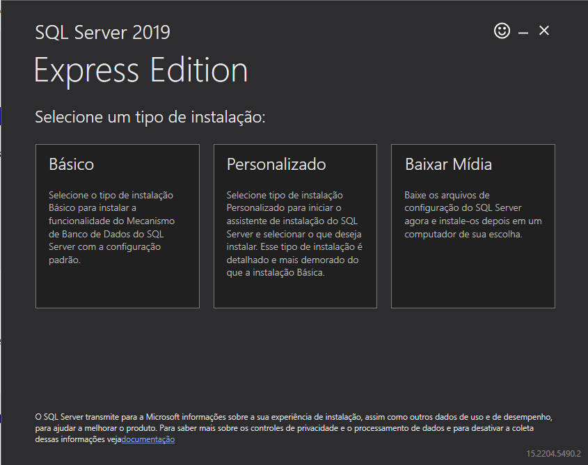
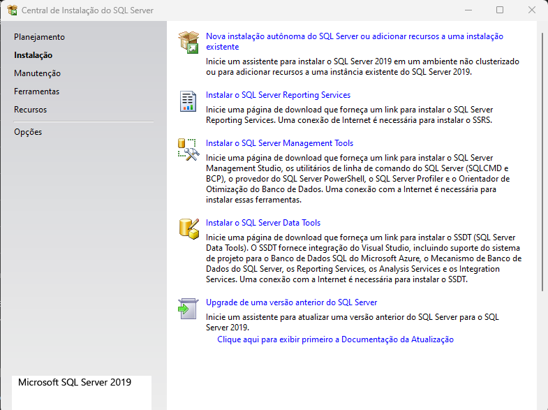
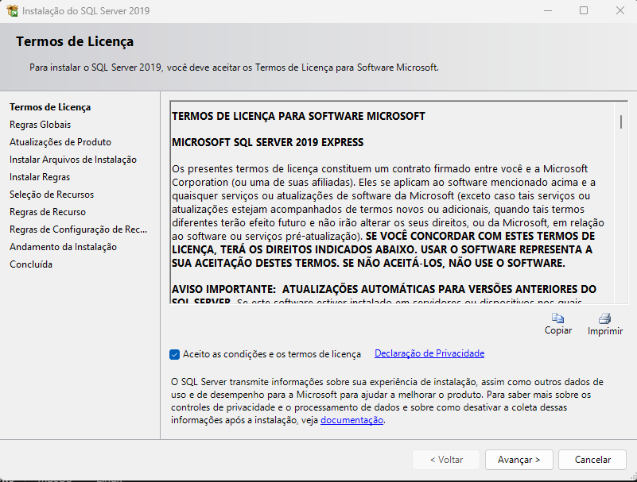
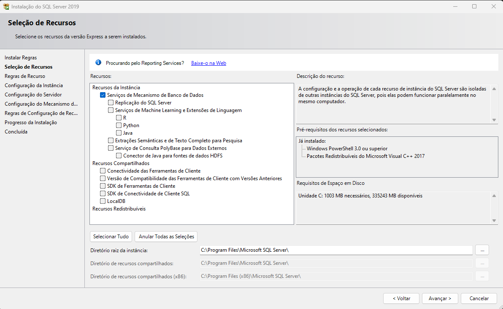
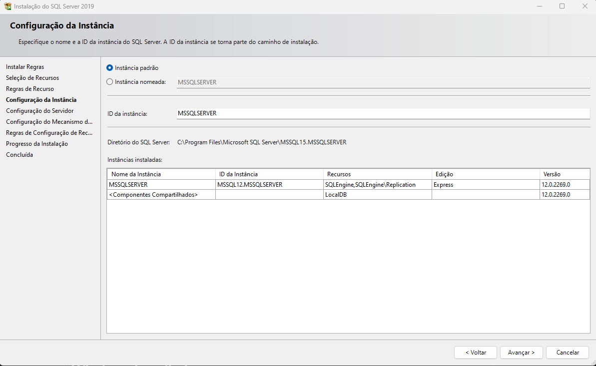
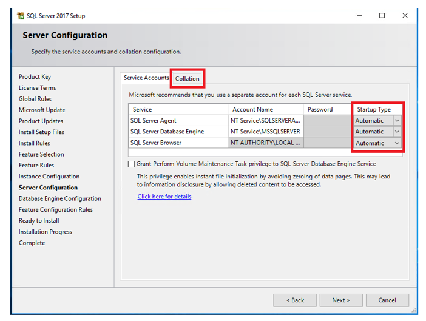
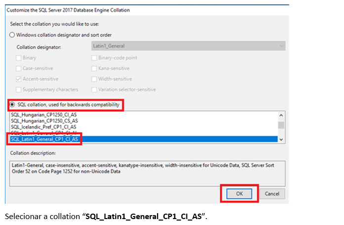
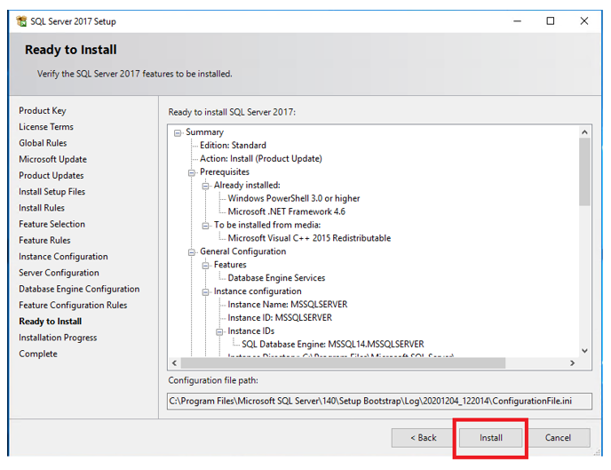

# 1. Verificar se há alguma instalação antiga

1. Pesquisar pelo programa *SQL Server Configuration Manager* nas instalações. Caso o programa esteja instalado, provavelmente já existe uma instância de SQL Server instalada na máquina.
2. Para verificar as instâncias instaladas, basta selecionar o item *SQL Server Services* dentro do programa.

# 2. Instalar e configurar uma nova instância do SQL Server

1. Baixar e executar o [instalador do SQL Server](https://www.microsoft.com/pt-br/download/details.aspx?id=101064) e selecionar "Personalizado".
   
   
2. Inicializar instalação (*stand-alone*)
   

3. Aceitar os termos de licença
   

4. Selecionar recursos para instalação
   

   Inicialmente instalaremos somente a Engine do SQL Server, para a instalação ficar mais "leve". Caso futuramente exista a necessidade de instalar outra feature, isto pode ser feito de forma manual.

5. Selecionar a **instância padrão** a ser instalada.
   

   **Caso já exista uma instalação anterior do SQL Server, esta etapa pode apresentar um erro.** Para contorná-lo, pode-se alterar a opção de instalação para **instância nomeada**, com um nome arbitrário (sugestão: *SQLSERVER2019*).

6. Configuramos os serviços básicos do SQL para serem inicializados automaticamente.
   

   - Na aba *Collation*, clicar em *Customize* e escolher a opção ***SQL_Latin1_General_CP1_CI_AS***
   

7. Após as etapas seguintes concluídas, inicializar a instalação.
   